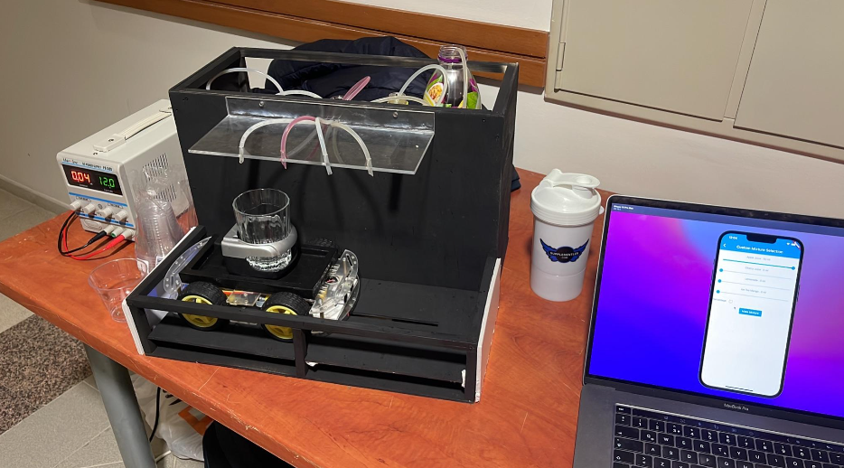

# Automatic Liquid Mixer Robot

This project was developed for **ELEC 491 – Electrical Engineering Design Project** by Atakan Zeki Atılgan and Ali Karataş. It is an **Automatic Liquid Mixer Robot** that prepares drink mixtures based on orders sent from a mobile application.

The system consists of three main parts:
- a **mobile application**,
- a **liquid dispenser mechanism**, and
- a **cart mechanism**.

The user places a glass on the cart, selects the drink mixture from the app, and the robot moves the glass under the correct pumps to dispense the requested amounts of liquid.

## Project Overview
The image below shows the final integrated system used during the project demo.

## Cart Mechanism
The cart mechanism is responsible for moving the glass along a single axis so it can stop under the correct pump. It consists of an Arduino Micro, 4 motors, 1 motor driver, 2 distance sensors, and 1 Bluetooth module. The cart receives the target pump location from the liquid dispenser system, estimates its current position using distance sensor readings, moves in the required direction, and stops when it reaches the correct pump. It then sends its position back to the liquid dispenser and waits for the next instruction.

## Liquid Dispenser Mechanism
The liquid dispenser mechanism consists of 4 pumps, 2 motor drivers, 1 Arduino Mega, 1 Adafruit Huzzah, and 1 Bluetooth module. Its job is to coordinate the drink preparation process and dispense the requested liquid at the correct pump and in the correct amount. The Huzzah receives the order through Wi-Fi, sends instructions to the Mega, and the Mega communicates with the cart through Bluetooth to position the glass correctly before activating the appropriate pump. Based on pump testing, the system dispensed roughly 1 millilitre per second, which allowed requested amounts to be translated into pump running time.

## Mobile Application
The mobile application was built using Dart and Flutter, allowing the same codebase to run on both iOS and Android. Through the app, users can choose drink size, assign drink names, enter new liquid names, and create mixtures in different ways. The app supports both custom mixtures, where users specify the amount or percentage of each liquid, and preset mixtures, which are generated based on the available liquids connected to the pumps.

## Communication

- The **mobile application** communicates with the liquid dispenser over **Wi-Fi**
- The **cart** and **liquid dispenser** communicate with each other over **Bluetooth**

## Results

The final system was built and demonstrated successfully. During testing and demo day, it was able to prepare multiple mixtures as intended and dispense specific amounts of selected liquids.

## Limitation

The main limitation observed in the project was **battery depletion** during extended use (for the cart).

## Notes

This project combines in a single working system:
- embedded systems,
- hardware design,
- communication between multiple controllers, and
- cross-platform mobile app development with Flutter and Dart

##Demo 
[Link to the Demo Video](https://drive.google.com/file/d/14Gh3Uhank0esE6RO5UTVgj2YA5p91s2-/view?usp=sharing)
